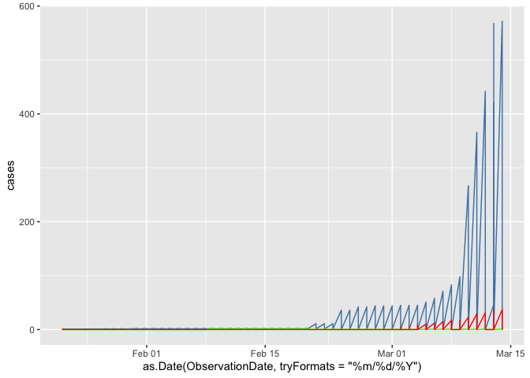

CoronaVirus Data Analysis
================

Reading the Data File: covid\_19\_data.csv Data Fields are: Sno - Serial
number ObservationDate - Date of the observation in MM/DD/YYYY
Province/State - Province or state of the observation (Could be empty
when missing) Country/Region - Country of observation Last Update - Time
in UTC at which the row is updated for the given province or country.
(Not standardised and so please clean before using it) Confirmed -
Cumulative number of confirmed cases till that date Deaths - Cumulative
number of of deaths till that date Recovered - Cumulative number of
recovered cases till that
date

``` r
data <- read.csv('novel-corona-virus-2019-dataset/covid_19_data.csv',header=TRUE)
orig_data <- data
```

OnservationDate is factor converting it to Date
format

``` r
data$ObservationDate <- as.Date(as.character(data$ObservationDate),tryFormats = "%m/%d/%Y")
```

``` r
d <- data[data$Country.Region=="India",]
```

To calculate the total number of Confirmed,Recovered and Deaths we need
to get the count of last updated entry for each province and state

``` r
library(dplyr)
```

    ## 
    ## Attaching package: 'dplyr'

    ## The following objects are masked from 'package:stats':
    ## 
    ##     filter, lag

    ## The following objects are masked from 'package:base':
    ## 
    ##     intersect, setdiff, setequal, union

``` r
data <- data %>% 
  group_by(Country.Region,Province.State) %>% 
  filter(ObservationDate==max(ObservationDate)) %>% 
  ungroup()

print(paste0("Total Confirmed cases around the world:" , sum(data$Confirmed)))
```

    ## [1] "Total Confirmed cases around the world:160005"

``` r
print(paste0("Total Recovered cases around the world:" , sum(data$Recovered)))
```

    ## [1] "Total Recovered cases around the world:72784"

``` r
print(paste0("Total Deaths cases around the world:" , sum(data$Deaths)))
```

    ## [1] "Total Deaths cases around the world:5893"

``` r
Percent_death = (sum(data$Deaths)/sum(data$Confirmed))* 100

print(paste0("Percentage of Deaths around the world:" , Percent_death))
```

    ## [1] "Percentage of Deaths around the world:3.68300990594044"

``` r
recovery_percent = (sum(data$Recovered)/sum(data$Confirmed))* 100
print(paste0("Percentage of Recovery around the world:" , recovery_percent))
```

    ## [1] "Percentage of Recovery around the world:45.4885784819224"

Plotting the Increase in cases in India over time

``` r
library(ggplot2)
library(dplyr)
orig_data %>% 
  filter(Country.Region=='India') %>% 
  ggplot(.,aes(x=as.Date(ObservationDate, tryFormats = "%m/%d/%Y") ,y=cases))+ geom_line(aes(y=Confirmed),color="steelblue")+
  geom_line(aes(y=Recovered),color="Green")+
  geom_line(aes(y=Deaths),color="Red")
```

<!-- -->

``` r
orig_data %>% 
  filter(Country.Region=='US') %>% 
  ggplot(.,aes(x=as.Date(ObservationDate, tryFormats = "%m/%d/%Y"),y=cases))+ geom_line(aes(y=Confirmed),color="steelblue")+
  geom_line(aes(y=Recovered),color="Green")+
  geom_line(aes(y=Deaths),color="Red")
```

<!-- -->

``` r
orig_data %>% 
  filter(Country.Region=='Mainland China') %>% 
  ggplot(.,aes(x=as.Date(ObservationDate, tryFormats = "%m/%d/%Y"),y=cases))+ geom_line(aes(y=Confirmed),color="steelblue")+
  geom_line(aes(y=Recovered),color="Green")+
  geom_line(aes(y=Deaths),color="Red")
```

<!-- -->

``` r
orig_data %>% 
  filter(Country.Region=='Italy') %>% 
  ggplot(.,aes(x=as.Date(ObservationDate, tryFormats = "%m/%d/%Y"),y=cases))+ geom_line(aes(y=Confirmed),color="steelblue")+
  geom_line(aes(y=Recovered),color="Green")+
  geom_line(aes(y=Deaths),color="Red")
```

<!-- -->

``` r
orig_data %>% 
  filter(Country.Region=='Iran') %>% 
  ggplot(.,aes(x=as.Date(ObservationDate, tryFormats = "%m/%d/%Y"),y=cases))+ geom_line(aes(y=Confirmed),color="steelblue")+
  geom_line(aes(y=Recovered),color="Green")+
  geom_line(aes(y=Deaths),color="Red")
```

<!-- -->

Summarize Number of Deaths,recovery and Death rate by Country

``` r
d <- data %>% 
  group_by(Country.Region) %>% 
  summarize(Confirmed=sum(Confirmed),Recovered=sum(Recovered),Deaths=sum(Deaths))
```

Plotting the top 10 country with Confirmed cases

``` r
top_Confirmed <- d %>% 
  arrange(desc(Confirmed) ) %>%  
  head(10)

top_Confirmed %>% 
  ggplot(.,aes(x=reorder(Country.Region,-Confirmed),y=Confirmed))+
  geom_bar(stat="identity")+
  xlab("Top 10 Country with highest cases")+
  theme(axis.text.x=element_text(angle =- 90, vjust = 0.5))
```

<!-- -->
Recovery ratio for countries with cases \> 1000 Plotting the top 10
countries with highest recovery rate

``` r
 d1 <- d %>% 
  filter(Confirmed > 1000) %>% 
  group_by(Country.Region) %>% 
   mutate(recovered_ratio=(Recovered/Confirmed)) 

top_Recovered <- d1 %>% 
  arrange(desc(recovered_ratio) ) %>% 
  head(10)


top_Recovered %>% 
  ggplot(.,aes(x=reorder(Country.Region,-recovered_ratio),y=recovered_ratio))+
  geom_bar(stat="identity")+
  xlab("Top 10 Country with highest recovery")+
  theme(axis.text.x=element_text(angle =- 90, vjust = 0.5))
```

<!-- -->

``` r
d1 <- d %>% 
  filter(Confirmed > 1000) %>% 
  group_by(Country.Region) %>% 
   mutate(death_ratio=(Deaths/Confirmed)) 

Deaths_Ratio <- d1 %>% 
  arrange(desc(death_ratio) ) %>% 
  head(10)


Deaths_Ratio %>% 
  ggplot(.,aes(x=reorder(Country.Region,-death_ratio),y=death_ratio))+
  geom_bar(stat="identity")+
  xlab("Top 10 Country with highest Death Rate")+
  theme(axis.text.x=element_text(angle =- 90, vjust = 0.5))
```

<!-- -->
